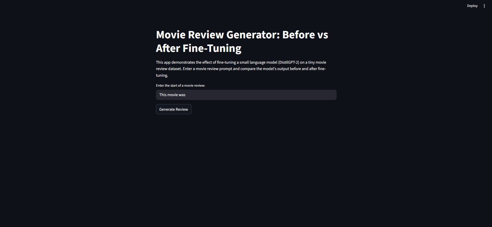
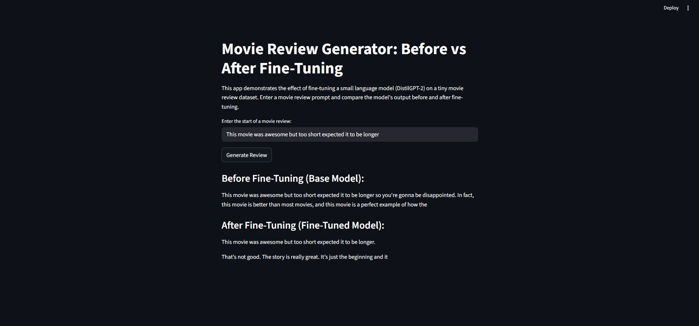

# Movie Review Generator: Before vs After Fine-Tuning

This project demonstrates the effect of fine-tuning a small language model (DistilGPT-2) on a tiny movie review dataset using Hugging Face Transformers and Datasets. The app provides a Streamlit UI to compare the model's output before and after fine-tuning.

## Features
- Fine-tunes DistilGPT-2 on 100 movie reviews from the Rotten Tomatoes dataset
- Lets you enter a movie review prompt and see how the model responds before and after fine-tuning
- Easy-to-use Streamlit web interface

## Setup Instructions

1. **Clone the repository or download the files**

2. **Install dependencies**
   ```sh
   pip install -r requirements.txt
   ```

3. **Run the Streamlit app**
   ```sh
   streamlit run app.py
   ```

4. **Interact with the app**
   - Enter the start of a movie review in the input box
   - Click "Generate Review" to see outputs from the base and fine-tuned models

## File Overview
- `app.py` — Main Streamlit app with all logic and UI
- `requirements.txt` — List of required Python packages
- `README.md` — Project documentation (this file)

## Notes
- The app uses only 100 samples and a small model for quick, CPU-friendly demonstration. For real applications, use larger datasets and more training steps.
- The fine-tuning process will run the first time you launch the app and save the model for future use.

## References
- [Hugging Face Transformers](https://huggingface.co/transformers/)
- [Rotten Tomatoes Dataset](https://huggingface.co/datasets)

## App Images







---

Feel free to modify the code or dataset for your own experiments! 